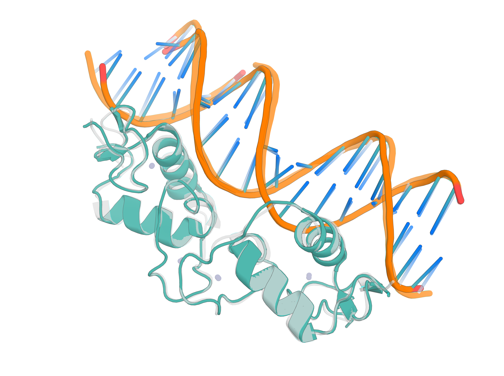

# Open-Source Neural Networks for Biomolecular Tasks

`ModelForge` is a repository of open-source models for common biomolecular tasks, including structure prediction, fixed-backbone sequence design ("inverse folding"), and *de novo* protein design.

All models within `ModelForge` share a common training harness and integrate with [AtomWorks](https://github.com/RosettaCommons/atomworks) – our generalized computational framework for biomolecular modeling.

For more information, please see our preprint, [Accelerating Biomolecular Modeling with AtomWorks and RF3](https://doi.org/10.1101/2025.08.14.670328).

> [!WARNING]
> We fixed an inference bug on 8/29 that arose during codebase migration and impacted predictions from JSON and from mmCIF/PDB; the issue is now resolved but for the purposes of model benchmarking predictions should be re-run.

> [!IMPORTANT]
> We are currently finalizing some cleanup work within our repositories. Please expect the APIs (e.g., function and class names, inputs and outputs) to stabilize within the next two weeks. Thank you for your patience!

> [!NOTE]
> Training code coming very soon, with documentation on how to fine-tune on new datasets! 

## RosettaFold3 (RF3)

[RF3](https://doi.org/10.1101/2025.08.14.670328) is a structure prediction neural network that narrows the gap between closed-source AF-3 and open-source alternatives.

<div align="center">
  
</div>

> [!TIP]
> Complete inference instructions for RF3 are provided [here](src/modelhub/inference_engines/README.md).

### RF3 Quick Start - Installation & Usage

Follow these steps to set up **ModelForge** and run a test prediction with **RF3**.

---

#### 1. Install the repository using `uv`

```bash
git clone https://github.com/RosettaCommons/modelforge.git \
  && cd modelforge \
  && uv python install 3.12 \
  && uv venv --python 3.12 \
  && source .venv/bin/activate \
  && uv pip install -e .
```

#### 2. Download model weights for RF3 
```bash
wget http://files.ipd.uw.edu/pub/rf3/rf3_latest.pt
```

#### 3. Run a test prediction
```bash
rf3 fold tests/data/5vht_from_json.json
```

Details on the exact formatting of the json files are available [here](src/modelhub/inference_engines/README.md).